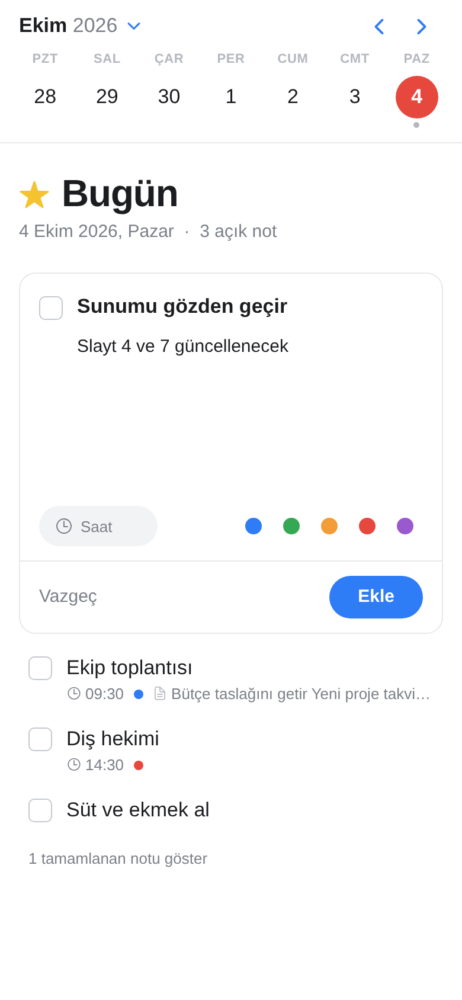

# Chronos

Sade bir ajanda: takvimden günü seç, o günün notlarını hemen yaz. Tasarım dili, iki Apple Design Award
almış **Things 3**'ten (beyaz alan, büyük gün başlığı, yüzen "+" düğmesi, açılan not kartı) ve takvim
kısmı **Fantastical** / Apple Takvim'den esinlenir.

| Telefon | Yeni not | Koyu tema | Tablet |
|---|---|---|---|
|  |  |  |  |

## Telefonda denemek (en kolay yol)

1. Telefona **Expo Go** uygulamasını kur (App Store / Google Play).
2. Bilgisayarda Node.js 22 veya üzeri kurulu olsun. Proje klasöründe:
   ```bash
   npm install
   npx expo start
   ```
3. Ekranda çıkan QR kodu iPhone'da kamerayla, Android'de Expo Go içinden okut.

Telefon ve bilgisayar aynı Wi-Fi ağında olmalı. Olmuyorsa `npx expo start --tunnel` dene.

## Kullanım

- Üstteki takvimden güne dokun. Takvim hafta şeridi olarak açılır; ay adına dokununca tüm ay açılır.
- Sağ alttaki mavi **+** düğmesi yeni not kartını açar: başlık, geniş açıklama alanı, saat ve renk etiketi.
  Saat alanına `930`, `9:30` veya `14` gibi yazabilirsin; boş bırakıp başlığa "14:30 Toplantı" yazmak da olur.
- Nota dokununca aynı kart açılır; düzenle, rengini değiştir ya da sil. Kutucuk notu tamamlar.
- Tamamlanan notlar listenin altında gizlenir; "tamamlanan notu göster" ile açılır.
- Bilgisayarda Ctrl/Cmd + Enter kaydeder, Esc kapatır. Telefonun açık/koyu temasına otomatik uyar.

## Tarayıcı önizlemesi

```bash
npm run web:preview
npx serve dist-web        # veya: python3 -m http.server -d dist-web 8080
```

Zip paketinde hazır derlenmiş kopya `web-onizleme/` klasöründedir:
`python3 -m http.server -d web-onizleme 8080` ile açıp http://localhost:8080 adresine git
(dosyaya çift tıklamak çalışmaz). Tarayıcıda notlar o tarayıcıya kaydedilir.

## Testler

```bash
npm run typecheck
npm test
```

## Mağaza için derleme (isteğe bağlı)

```bash
npm install -g eas-cli
eas build --platform android   # veya ios
```
