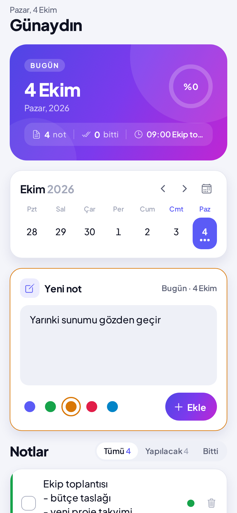
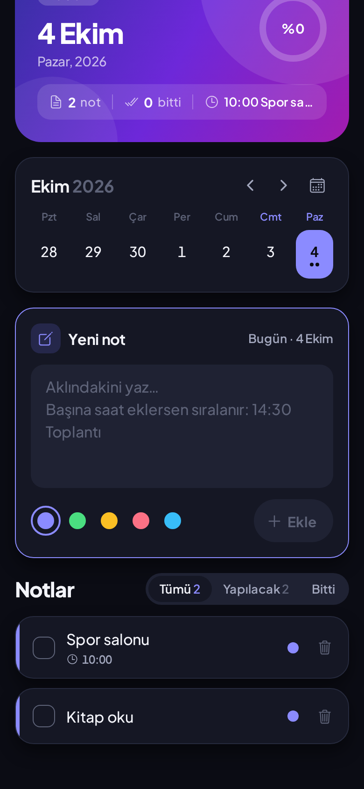
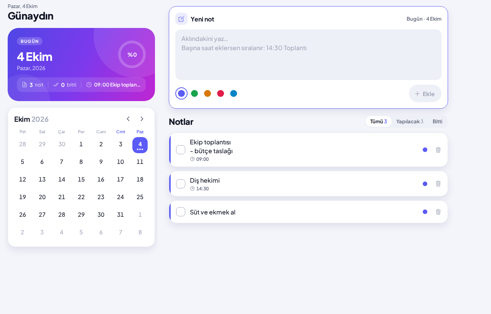

# Chronos

Şık ve sade bir ajanda paneli: takvimden günü seç, o günün notlarını hemen yaz.

| Telefon | Koyu tema | Tablet |
|---|---|---|
|  |  |  |

## Telefonda denemek (en kolay yol)

1. Telefona **Expo Go** uygulamasını kur (App Store / Google Play).
2. Bilgisayarda Node.js 22 veya üzeri kurulu olsun. Proje klasöründe:
   ```bash
   npm install
   npx expo start
   ```
3. Ekranda çıkan QR kodu iPhone'da kamerayla, Android'de Expo Go içinden okut.

Telefon ve bilgisayar aynı Wi-Fi ağında olmalı. Olmuyorsa `npx expo start --tunnel` dene.

## Kullanım

- Takvimde bir güne dokun; "Yeni not" kartındaki geniş alana yaz (çok satır olabilir) ve "Ekle"ye dokun. Bilgisayarda Ctrl/Cmd + Enter da ekler.
- Notun başına veya sonuna saat yazarsan saat etiketi olur ve gün içinde sıralanır: `14:30 Diş hekimi`.
- Kutucuğa dokununca not tamamlanır, metne dokununca düzenlenir, çöp kutusu ile silinir.
- "Ekle" düğmesinin yanındaki renklerden notun rengini seç; not kartındaki renkli noktaya dokunarak sonradan değiştir.
- Üstteki kart günün özetini gösterir: not sayısı, tamamlanma yüzdesi ve sıradaki saatli not.
- Takvim hafta şeridi olarak açılır; takvim simgesiyle tüm ayı aç. Notu olan günlerin altında nokta görünür.
- "Tümü / Yapılacak / Bitti" sekmeleriyle notları süz. Başka bir gündeyken sağ üstteki düğme bugüne döner.
- Telefonun açık/koyu temasına otomatik uyar.

## Tarayıcı önizlemesi

```bash
npm run web:preview
npx serve dist-web        # veya: python3 -m http.server -d dist-web 8080
```

Zip paketinde hazır derlenmiş kopya `web-onizleme/` klasöründedir:
`python3 -m http.server -d web-onizleme 8080` ile açıp http://localhost:8080 adresine git
(dosyaya çift tıklamak çalışmaz). Tarayıcıda notlar o tarayıcıya kaydedilir.

## Testler

```bash
npm run typecheck
npm test
```

## Mağaza için derleme (isteğe bağlı)

```bash
npm install -g eas-cli
eas build --platform android   # veya ios
```
