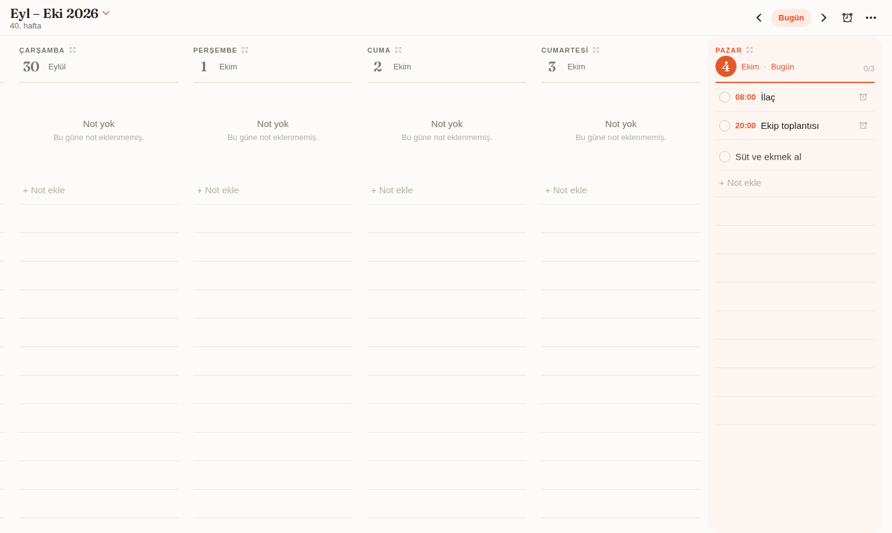
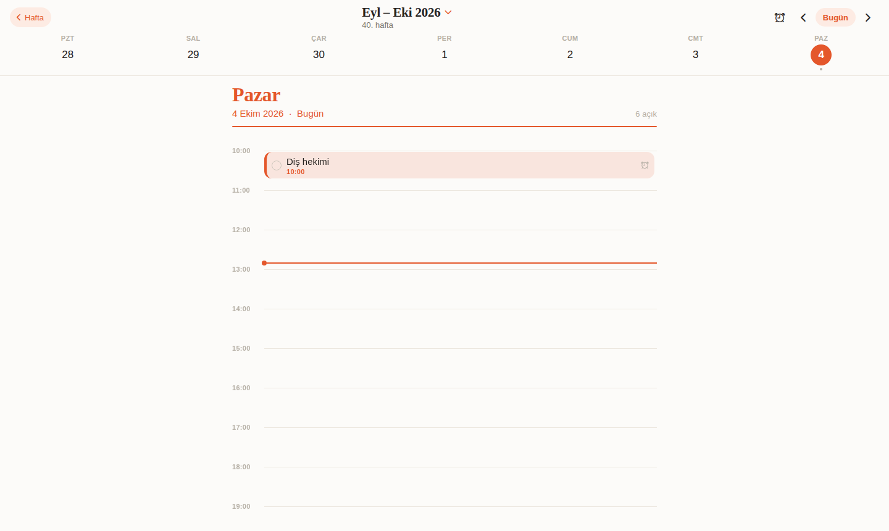
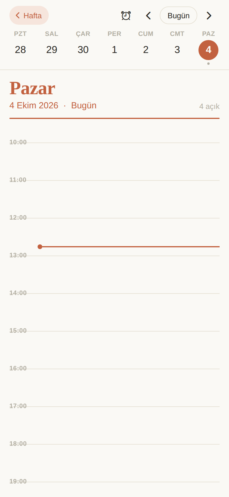
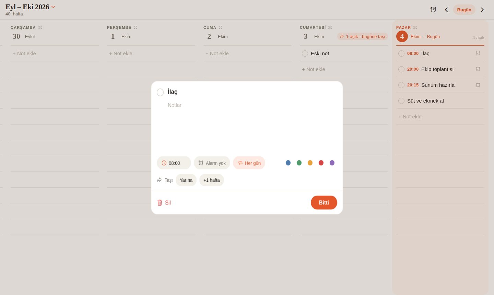
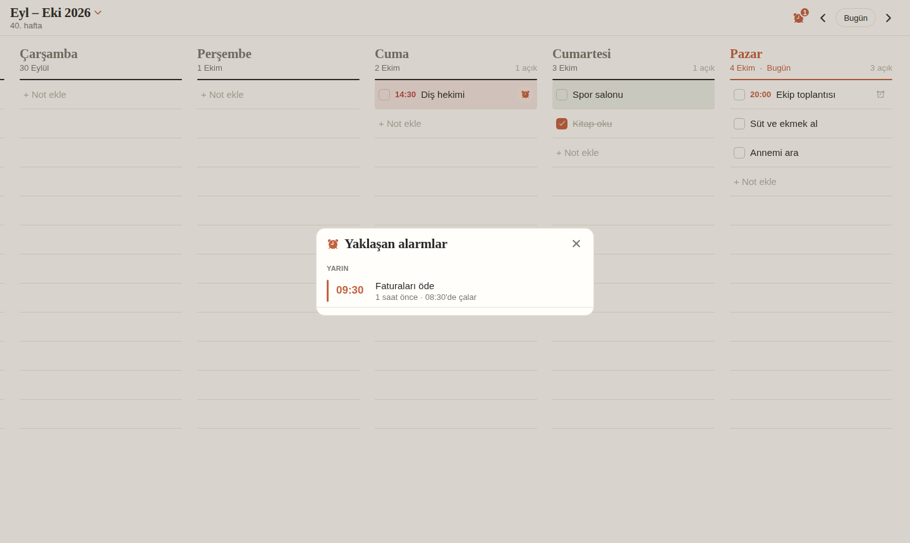
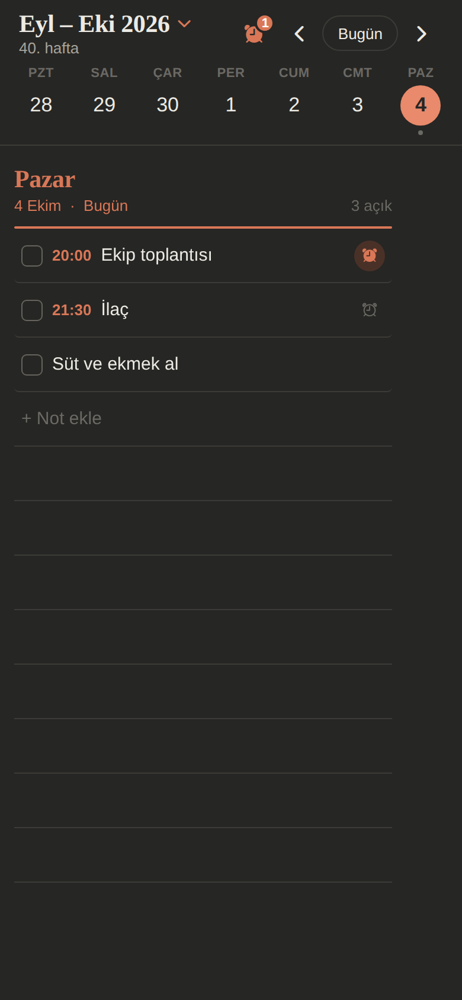
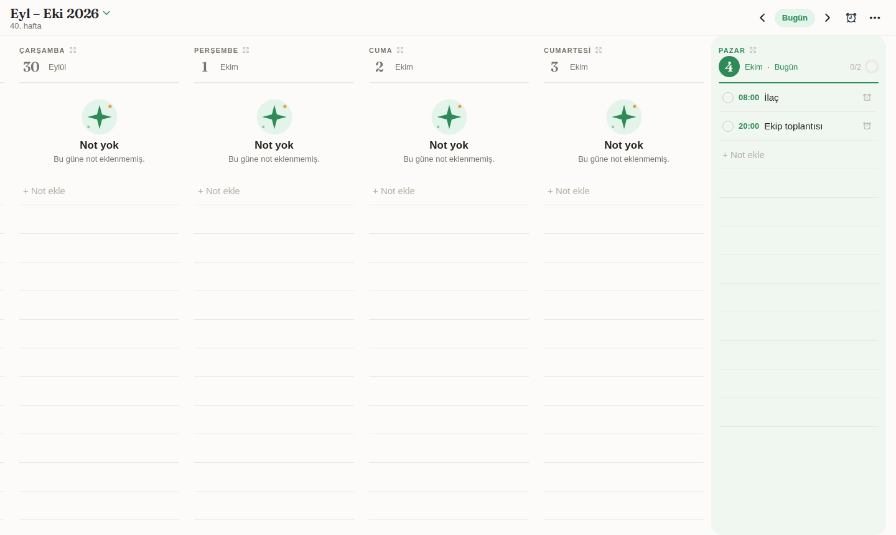
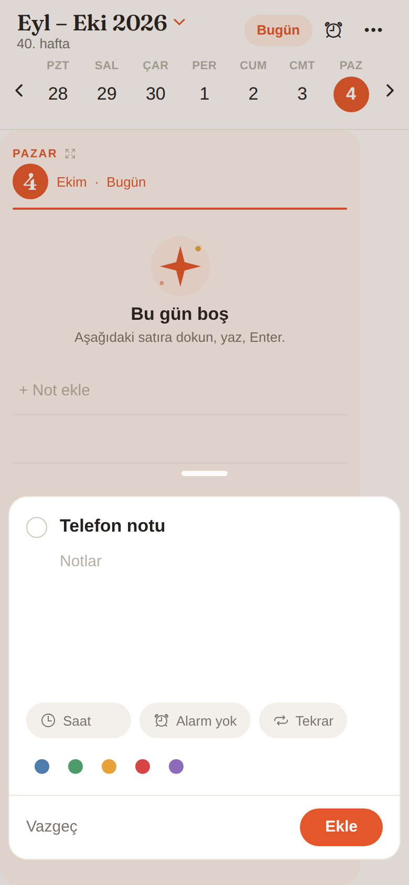
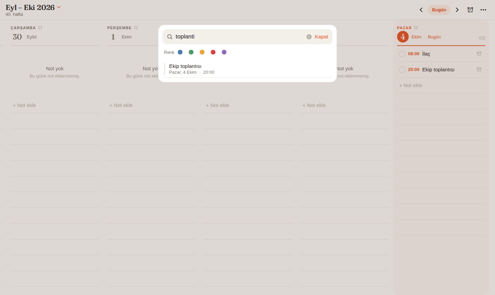

# Chronos

Haftalık planlayıcı: haftanın her günü, çizgili bir defter sayfası gibi ayrı bir sütun. Boş satıra
dokun, yaz, Enter'a bas; not o güne eklenir. Tasarım, GitHub'daki
[weekly-planner](https://github.com/topics/weekly-planner) konusunun en popüler projesi
[WeekToDo](https://github.com/manuelernestog/weektodo)'dan esinlenir (kodu kopyalanmadı, yalnızca düzen örnek alındı).
Renkler sıcak bir kağıt havasında: sıcak beyaz zemin, canlı turuncu vurgu, tırnaklı başlıklar, bugünün sütunu yumuşak panelde.

| Hafta | Gün (saat çizelgesi) | Telefon, gün | Tekrar ve taşı | Alarmlar | Koyu tema |
|---|---|---|---|---|---|
|  |  |  |  |  |  |

| Renk teması (orman) | Telefonda yeni not | Arama |
|---|---|---|
|  |  |  |

## Telefonda denemek (en kolay yol)

1. Telefona **Expo Go** uygulamasını kur (App Store / Google Play).
2. Bilgisayarda Node.js 22 veya üzeri kurulu olsun. Proje klasöründe:
   ```bash
   npm install
   npx expo start
   ```
3. Ekranda çıkan QR kodu iPhone'da kamerayla, Android'de Expo Go içinden okut.

Telefon ve bilgisayar aynı Wi-Fi ağında olmalı. Olmuyorsa `npx expo start --tunnel` dene.

## Kullanım

- **Hafta görünümü:** geniş ekranda günler yan yana sütunlar; telefonda bir gün tam ekran, yana kaydırınca sonraki gün,
  üstteki gün şeridine dokunarak da atlanır. Bir günün **"+ Not ekle"** satırına (ya da boş çizgilere) dokun, yaz, Enter'a bas;
  satır açık kalır, peş peşe not yazabilirsin. Başa saat yazarsan (`09:00 Toplantı`, `930 Spor`) saat ayrıca görünür.
- **Gün görünümü:** gün adına (ya da yanındaki ⤢ simgesine) dokununca o gün saat çizelgesiyle açılır. Saatli notlar saatinde
  bloklar halinde durur (üst üste binenler yan yana), saatsizler "Gün boyu" bölümündedir, bugünde şimdiki zaman çizgisi
  görünür. Boş bir saate dokunursan o saatte yeni not açılır. Sola/sağa kaydırınca ya da ‹ › oklarıyla gün değişir;
  "‹ Hafta" haftaya döner.
- Kutucuk notu tamamlar. Nota dokununca ayrıntı kartı açılır: açıklama, saat, renk etiketi, alarm, tekrar, taşı, sil.
- **Tekrar:** kartta 🔁 çipinden *her gün, hafta içi, her hafta, her ay* seç. Tekrarlar gerçek notlardır (her birini ayrı
  tamamlarsın) ve en az 30 gün ilerisine kadar otomatik oluşturulur. Tekrarı "Tekrar yok" yaparsan o günden sonraki
  tamamlanmamış tekrarlar silinir.
- **Taşı:** kartta *Bugüne / Yarına / +1 hafta*. Geçmiş bir günde bitmemiş not varsa sütun başlığındaki
  "N açık · bugüne taşı" düğmesi hepsini tek dokunuşla bugüne aktarır.
- **Alarm:** saati olan her notun sağında ⏰ zil vardır; dokununca alarm seçenekleri açılır (tam saatinde, 5/15/30 dk,
  1 saat veya 1 gün önce). Üst çubuktaki zil, sayısıyla birlikte yaklaşan tüm alarmları listeler. İlk seferde bildirim izni
  sorulur. Bildirimde **"10 dk ertele"** ve **"Tamamla"** düğmeleri çıkar (düğmeye basınca uygulama açılır ve işlemi yapar);
  bildirime dokunmak o günün görünümünü açar. Tekrarlayan notların alarmları yalnızca 21 gün öncesinden kurulur
  (iOS en çok 64 bekleyen bildirim tutar); uygulamayı en az üç haftada bir açman yeterli. Tarayıcı önizlemesinde alarm çalmaz.
- **Doğal dille ekleme:** satıra `yarın 15:00 diş hekimi`, `cuma toplantı 10.30`, `3 gün sonra rapor`, `haftaya salı sunum`
  `saat 3 te toplantı` ya da `15 Ekim doğum günü` yaz; gün ve saati kendisi bulur (not o güne eklenir, görünüm oraya geçer). Gün adı ya da bugün/yarın
  yalnızca metnin başında ya da sonunda aranır.
- **Alt görevler:** kartta *Alt görev ekle* ile küçük maddeler; satırda `2/4` olarak görünür. Maddeler açıklamada `[ ] madde`
  satırları olarak saklanır.
- **Tamamlananlar sona iner ve soluklaşır;** tamamlayınca yazının üstünden çizgi çekilir.
- **Günlük özet:** Ayarlar'dan 07:00, 08:00 ya da 09:00 seç; o saatte "Bugün 4 notun var" bildirimi gelir (önümüzdeki 7 gün, notlar
  değiştikçe güncellenir; iOS 64 bildirim sınırı için yalnızca 7 gün kurulur). Tarayıcıda çalmaz.
- **Süre:** başa `14:00-15:30 Toplantı` yaz ya da kartta *Bitiş* çipini seç; gün görünümünde blok süre kadar uzar, "14:00–15:30" görünür.
  Alarmı 60 dk içinde olan notta "alarm N dk sonra" yazar.
- **Geri al:** silme, taşıma ve tamamlamadan sonra alttaki çubukta 5 saniye *Geri al* çıkar.
- **Çoklu seçim:** nota uzun bas → *Seç*; sonra istediğin kadar nota seçip alttaki çubuktan *Tamamla / Bugüne / Yarına / Sil*.
- **Bugün listesi (⋯ menüsü):** geciken (son 60 gün) ve bugünkü açık notlar tek listede; her birini *Bugüne / Yarına* al ya da "Hepsini bugüne al".
- **Şablonlar (⋯ menüsü):** sık kullanılan listeleri (ör. alışveriş, sabah rutini) kaydet; seçili güne alt görevleriyle eklenir.
- **Bağlantılar:** notta `https://...` varsa kartta çip olarak görünür, dokununca açılır.
- **Görünüm:** Ayarlar → Sistem / Açık / Koyu (elle seçilebilir).
- **Saf siyah:** Ayarlar'dan koyu temada tam siyah zemin (OLED). Hafta sütun başlığındaki ince çizgi günün doluluğunu gösterir.
- **Satır sıklığı:** Ayarlar'dan *Rahat* ya da *Sıkı*.
- **Uzun bas menüsü:** nota (satır ya da gün çizelgesindeki blok) uzun basınca *Düzenle, Tamamla/Geri al, Bugüne taşı, Yarına taşı, Sil*.
- **Telefonda +:** sağ alttaki turuncu düğme seçili güne yeni not açar; kart alttan yükselir, tutamaçtan aşağı çekince kapanır.
- **Sade ilerleme:** her günün başlığında tamamlanan not sayısı (`2/5`) görünür.
- **Zaman çizgisi:** gün görünümünde bugün için şimdiki zaman çizgisi.
- **⋯ menüsü:** *Ara* (notlarda arama + renk süzgeci) ve *Ayarlar* (renk teması: turuncu, mercan, orman, deniz, mor; yedeği kopyala/paylaş; yedekten geri yükle).
- Telefonun açık/koyu temasına otomatik uyar.

## PWA olarak kurmak (bilgisayar ve telefon)

`npm run web:preview` çıktısı (`dist-web/`, zip'te `web-onizleme/`) kurulabilir bir PWA'dır: manifest, simgeler ve
çevrimdışı önbellek (service worker) içerir. Kurulum için klasör **HTTPS** ile barındırılmalıdır (ücretsiz: Vercel, Netlify,
Cloudflare Pages, GitHub Pages; klasörü olduğu gibi yükle). Sonra:

- **Windows/Mac (Chrome, Edge):** adres çubuğundaki "Yükle" simgesi ya da menü → *Chronos'u yükle*. Adres çubuğu olmayan ayrı pencerede açılır.
- **iPhone/iPad (Safari):** Paylaş → *Ana Ekrana Ekle*.
- **Android (Chrome):** menü → *Uygulamayı yükle*.

Sınırlar: veriler her cihazda ve tarayıcıda ayrıdır (cihazlar arası senkron yok; Ayarlar → Yedek ile taşı); web'de alarm
bildirimi çalmaz (bildirimler yalnızca Expo Go / yerel derlemede).

## Tarayıcı önizlemesi

```bash
npm run web:preview
npx serve dist-web        # veya: python3 -m http.server -d dist-web 8080
```

Zip paketinde hazır derlenmiş kopya `web-onizleme/` klasöründedir:
`python3 -m http.server -d web-onizleme 8080` ile açıp http://localhost:8080 adresine git
(dosyaya çift tıklamak çalışmaz). Tarayıcıda notlar o tarayıcıya kaydedilir.

## Testler

```bash
npm run typecheck
npm test
```

## Mağaza için derleme (isteğe bağlı)

```bash
npm install -g eas-cli
eas build --platform android   # veya ios
```
