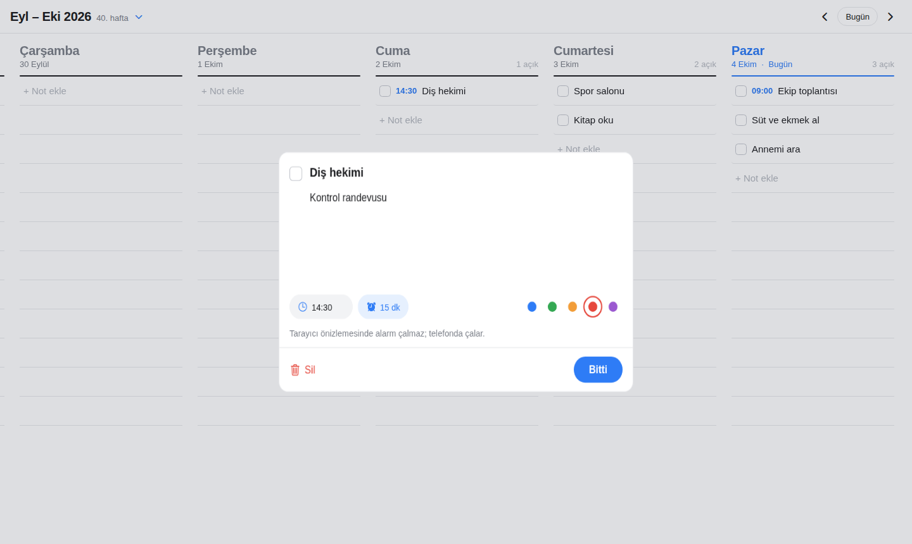
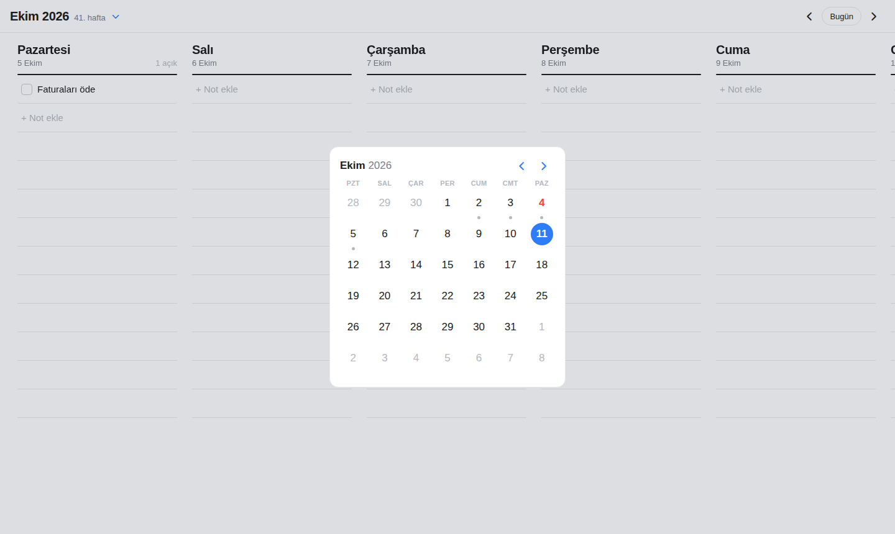

# Chronos

Haftalık planlayıcı: haftanın her günü, çizgili bir defter sayfası gibi ayrı bir sütun. Boş satıra
dokun, yaz, Enter'a bas; not o güne eklenir. Tasarım, GitHub'daki
[weekly-planner](https://github.com/topics/weekly-planner) konusunun en popüler projesi
[WeekToDo](https://github.com/manuelernestog/weektodo)'dan esinlenir (kodu kopyalanmadı, yalnızca düzen örnek alındı).

| Hafta (bilgisayar/tablet) | Telefon | Not ayrıntısı | Takvim | Koyu tema |
|---|---|---|---|---|
|  |  |  |  |  |

## Telefonda denemek (en kolay yol)

1. Telefona **Expo Go** uygulamasını kur (App Store / Google Play).
2. Bilgisayarda Node.js 22 veya üzeri kurulu olsun. Proje klasöründe:
   ```bash
   npm install
   npx expo start
   ```
3. Ekranda çıkan QR kodu iPhone'da kamerayla, Android'de Expo Go içinden okut.

Telefon ve bilgisayar aynı Wi-Fi ağında olmalı. Olmuyorsa `npx expo start --tunnel` dene.

## Kullanım

- **Geniş ekranda** hafta yan yana sütunlar halinde görünür; yana kaydırarak tüm günleri gezersin.
  **Telefonda** bir gün tam ekran görünür, yana kaydırınca sonraki güne geçer; üstteki gün şeridine dokunarak da atlayabilirsin.
- Bir günün **"+ Not ekle"** satırına (ya da altındaki boş çizgilere) dokun, yaz, Enter'a bas. Satır yeniden
  odaklanır, peş peşe not yazabilirsin. Başına saat yazarsan (`09:00 Toplantı`, `930 Spor`) saat ayrıca gösterilir.
- Kutucuk notu tamamlar (üstü çizilir). Nota dokununca ayrıntı kartı açılır: açıklama, saat, renk etiketi, alarm, silme.
- Üstteki **‹ ›** oklar haftayı değiştirir, **Bugün** bu haftaya döner. Ay adına dokununca ay takvimi açılır.
- **Alarm:** not kartında saat girdikten sonra ⏰ çipine dokun ve ne zaman çalacağını seç (tam saatinde, 5/15/30 dk,
  1 saat veya 1 gün önce). İlk seferde bildirim izni sorulur. Saati gelince telefon sesli bildirim gösterir;
  not tamamlanır veya silinirse alarm iptal olur. Tarayıcı önizlemesinde alarm çalmaz.
- Telefonun açık/koyu temasına otomatik uyar.

## Tarayıcı önizlemesi

```bash
npm run web:preview
npx serve dist-web        # veya: python3 -m http.server -d dist-web 8080
```

Zip paketinde hazır derlenmiş kopya `web-onizleme/` klasöründedir:
`python3 -m http.server -d web-onizleme 8080` ile açıp http://localhost:8080 adresine git
(dosyaya çift tıklamak çalışmaz). Tarayıcıda notlar o tarayıcıya kaydedilir.

## Testler

```bash
npm run typecheck
npm test
```

## Mağaza için derleme (isteğe bağlı)

```bash
npm install -g eas-cli
eas build --platform android   # veya ios
```
